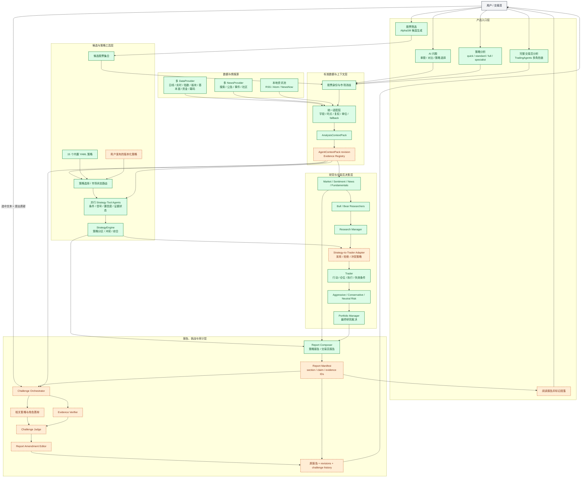

# Codex 股票分析产品功能图

> 文档状态：产品能力地图。绿色节点表示仓库已有能力，橙色节点表示本专项 Codex 工作流需要新增或衔接的目标能力，灰色节点表示用户或外部系统。

这张图用于让 Codex 在开始任务前快速判断：用户从哪个产品入口进入、需要哪些数据和策略、由哪个角色负责决策、最终产物在哪里，以及报告被挑战后应回到哪一层复核。

## 1. 端到端产品功能图



## 2. Codex 不渲染 Mermaid 时的功能树

```text
股票分析产品
├── 产品入口
│   ├── 股票筛选：生成候选，不直接形成交易决策
│   ├── AI 问股：协调数据、策略、Trader 和追问
│   ├── 策略分析：运行一个或多个 Strategy Tool Agent
│   ├── 交易员分析：运行完整研究、交易和风险角色链
│   └── 报告挑战：用户标记 section/claim 后发起对抗分析
├── 数据与上下文
│   ├── DataProvider：行情、指数、板块、基本面、资金、筹码
│   ├── NewsProvider：新闻、事件、公告、社区搜索
│   ├── Intelligence Pool：RSS、Atom、NewsNow
│   ├── Adapter：统一字段、市场、时点、复权、单位和 fallback
│   └── Context/Evidence：锁定分析 revision 和证据引用
├── 策略工具
│   ├── 15 个内置 YAML 策略
│   ├── 用户版本化策略
│   ├── required tools 证据门
│   ├── 单策略结构化意见
│   └── 多策略冲突与综合
├── 交易员团队
│   ├── 四类 Analyst
│   ├── Bull/Bear Researcher
│   ├── Research Manager
│   ├── Strategy-to-Trader Adapter
│   ├── Trader
│   ├── 三类 Risk Analyst
│   └── Portfolio Manager
└── 报告与挑战
    ├── Report Composer
    ├── Report Manifest / section / claim / evidence ID
    ├── Challenge Orchestrator
    ├── 相关策略与角色答辩
    ├── Evidence Verifier
    ├── Challenge Judge
    ├── Report Amendment Editor
    └── 原报告、修订和挑战历史
```

## 3. 功能节点路由表

| 节点 ID | 产品职责 | 主要输入 | 主要输出 | Codex 下一跳 |
| --- | --- | --- | --- | --- |
| `SCREEN` | 按筛选规则生成候选 | 市场、筛选策略、数量 | candidates、筛选解释和风险标记 | 为入围股票分别进入 `ID/ADAPTER` |
| `ASK` | 解析用户问题并协调能力 | 问题、股票 scope、策略选择、会话 | 文本/dashboard 或后续 workflow request | `ID`、`ROUTER`、`TRADERROLE` 或 `CHALLENGE` |
| `ID` | 确认股票代码、名称和市场 | 用户输入或候选 | 无歧义 subject；有歧义时返回候选 | `ADAPTER` |
| `ADAPTER` | 标准化所有 provider 数据 | 原始行情、基本面和情报 | 标准 blocks、来源链和质量 | `ACP/EVIDENCE` |
| `EVIDENCE` | 锁定上下文版本 | AnalysisContextPack、报告 cutoff | context revision、evidence registry | `SKILL`、`ANALYSTS`、`CHALLENGE` |
| `ROUTER` | 选择策略工具组合 | 用户选择、市场状态、策略目录 | selected strategies | 并行 `SKILL` |
| `SKILL` | 按单一规则检查证据 | 策略定义、context slice、required tools | signal、条件、分数、置信度、evidence status | `SYNTHESIS` |
| `SYNTHESIS` | 聚合且保留冲突 | verified/limited 策略结果 | strategy synthesis、冲突和 diagnostics | `ADOPT`、`COMPOSER` |
| `ANALYSTS` | 形成市场、情绪、新闻、基本面报告 | 同一 context 的不同 slice | 四类分报告 | `DEBATE`、`COMPOSER` |
| `ADOPT` | 把策略意见交给交易员 | synthesis、研究计划、组合约束 | adopted/rejected/conflicting strategies | `TRADERROLE` |
| `TRADERROLE` | 形成行动与仓位计划 | 研究、策略选择、价格和组合约束 | TraderProposal、执行与失效条件 | `RISK` |
| `RISK` | 挑战交易计划 | Trader plan、报告、质量和组合风险 | 三类风险意见 | `PM` |
| `PM` | 最终研究裁决 | Trader plan、完整风险辩论 | PortfolioDecision | `COMPOSER` |
| `MANIFEST` | 让报告可寻址和可审计 | 报告内容、context、evidence refs | report/section/claim IDs | 用户阅读或 `CHALLENGE` |
| `CHALLENGE` | 路由段落级质疑 | ChallengeRequest、原 context、原 claim | 参与角色和答辩任务 | `DEFENSE/VERIFY` |
| `JUDGE` | 裁决原 claim 是否成立 | 答辩与已核验证据 | keep/amend/append/retract | `AMEND` |
| `AMEND` | 生成最小报告增补 | 原文、裁决、允许的 patch 操作 | ReportAmendment | `HISTORY` |

## 4. 四种用户路径

### 4.1 用户给定股票并选择策略

```text
USER -> ASK/SA -> ID -> ADAPTER -> EVIDENCE
     -> ROUTER -> SKILL(s) -> SYNTHESIS
     -> ADOPT -> TRADERROLE -> RISK -> PM -> REPORT
```

### 4.2 用户先筛选股票

```text
USER -> SCREEN -> CANDIDATES
     -> 每个候选分别构建 EVIDENCE
     -> SKILL(s) -> TRADERROLE -> PM
     -> 候选比较报告
```

筛选阶段的 AlphaSift strategy 与分析阶段的 YAML strategy 是两层 ID，不应混写。

### 4.3 用户要求完整交易员分析

```text
USER -> TA -> ID -> EVIDENCE
     -> ANALYSTS -> BULL/BEAR -> RESEARCH MANAGER
     + STRATEGY TOOL(s) -> ADOPT
     -> TRADER -> RISK DEBATE -> PORTFOLIO MANAGER
     -> REPORT MANIFEST
```

### 4.4 用户挑战报告段落

```text
USER selection -> CHALLENGE
               -> 原角色答辩 + 反方角色 + EVIDENCE VERIFIER
               -> JUDGE
               -> AMENDMENT
               -> 原报告旁追加修订
```

## 5. 当前能力与目标能力图例

| 状态 | 含义 | 处理方式 |
| --- | --- | --- |
| 已有 | 仓库中已有实现，可从源码和现有 API/工具复用 | 先适配，不新增平行实现 |
| 目标 | 本文档定义但运行时尚未完整实现 | Codex 不得声称已经可调用；实现时按契约分阶段落地 |
| 外部 | 用户、第三方 provider 或外围系统 | 保留权限、网络和数据质量边界 |

当前最大的连接缺口不是某个新分析师，而是三条产品连线：

1. `AnalysisContextPack -> AgentContextPack/Evidence Registry`；
2. `Strategy Synthesis -> Strategy-to-Trader Adapter`；
3. `Report -> Manifest -> Challenge -> Amendment History`。

完成这三条连线后，现有数据、策略和 TradingAgents 角色才能形成用户要求的完整 Codex 专项工作流。

## 6. Codex 使用本图的规则

1. 先根据用户意图选择四种用户路径之一。
2. 再从功能节点路由表定位当前节点的输入、输出和下一跳。
3. 看到橙色目标节点时，区分“设计工作”与“调用现有功能”；除非已实现，否则不能尝试调用不存在的 API。
4. 所有个股分析在进入 Strategy 或 Trader 前必须经过身份解析和同一 revision 的 evidence context。
5. 策略结果进入 Trader 前必须经过采用/拒绝/冲突解释；不能让策略直接产生最终仓位。
6. 报告 challenge 必须回到产生该 claim 的证据和角色层，而不是让通用聊天 Agent 凭记忆重新回答。
7. 新数据刷新走新的 context revision，原报告审计继续使用原 revision。

详细字段和角色协议分别见：

- [数据源与标准数据契约](data-contracts.md)
- [策略工具与角色决策契约](strategy-and-role-contracts.md)
- [报告挑战与多 SubAgent 协作协议](multi-agent-challenge-workflow.md)
