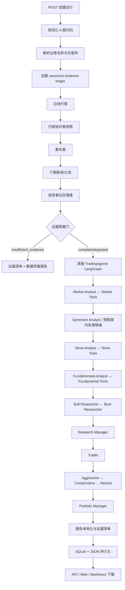

# TradingAgents A 股工作流与数据契约

本文是 DSA 交易员分析功能的重建规范，定义工作流、不可变边界、每个阶段的输入输出、字段语义、时点规则、降级规则和审计要求。后续若使用 Codex 或其他实现重建该功能，应以本文和可执行测试共同作为契约；代码行为与本文不一致时，先以可执行代码为准，再同步修正文档。

## 1. 目标与不可变边界

DSA 的职责不是重写 TradingAgents，而是给原版工作流注入适合中国 A 股的确定性身份、国内数据和模型路由，并把运行过程变成可审核的产品能力。

以下内容必须保持原版语义，不得因 A 股本地化而改变：

- LangGraph 的节点集合、节点顺序、边、条件路由和 Analyst → ToolNode → Analyst 循环。
- `AgentState`、`InvestDebateState`、`RiskDebateState` 的核心字段。
- Market、Sentiment、News、Fundamentals 四类分析，随后进入多空研究辩论、Research Manager、Trader、三类风险辩论和 Portfolio Manager 的顺序。
- Research Manager、Trader、Portfolio Manager 和 Sentiment Analyst 的 structured output schema。
- checkpoint、decision memory、辩论轮数和最终决策的基本逻辑。
- 未注入 DSA toolkit 时，上游 TradingAgents 仍走自己的默认工具和 Prompt。

允许且必须支持的本地化边界：

- 用 DSA 的 A 股身份解析替代上游的海外证券身份查询。
- 用 run-scoped `DsaTradingAgentsToolkit` 替代海外行情、新闻、基本面和情绪工具。
- 国内数据源优先，并保留 provider fallback、标准化、超时和来源链。
- Prompt 只增加证券身份、简体中文、A 股术语、人民币口径、已核验价位和动作感知的价格字段不变量，以及禁止虚构缺失证据等本地化约束；不得在全局身份 Prompt 中重写角色职责或强迫特定投资结论。
- 通过回调和工具包装记录完整 LLM/工具交互，通过证据清单披露模型可用数据、实际消费情况、来源和时间。
- 报告层把上游固定英文交易建议前缀本地化，不改变原始决策方向。

当前 DSA 对上游的注入 seam 只有 `data_toolkit` 和 `role_llms`。DSA 不增加、删除或重新连接任何 Graph 节点。

### 1.1 TradingAgents 依赖锁定

重建和部署所依赖的兼容构建固定为以下来源。分支名只用于追踪补丁演进，不得代替不可变 commit SHA：

| 项目 | 固定值 |
| --- | --- |
| 官方上游 | `https://github.com/TauricResearch/TradingAgents.git` |
| DSA 实际依赖源 | `https://github.com/davidyangss/TradingAgents.git` |
| 兼容分支 | `feat/injectable-data-toolkit-role-llms` |
| 固定 commit | `ab0909306075e413e2504deb85c9dc74b8650272` |
| Python distribution version | `0.3.1` |

`TRADER_ANALYSIS_TRADINGAGENTS_COMMIT` 应记录上述 SHA，但它当前只进入运行审计 metadata；运行时检查的是 distribution version 和 `data_toolkit`/`role_llms` seam，尚未从已安装包自动证明 Git commit。可复现安装必须直接从 DSA 实际依赖源按完整 SHA 构建或安装，不能使用浮动分支、`main` 或相邻工作目录。

## 2. 总工作流



注意：上图中的四类 Analyst 是原版 Graph 中按 execution plan 顺序执行，不是四个可随意并行、互换或跳过的 DSA 节点。证据预检也按确定顺序形成同一个 ledger，以便快照依赖日线、后续工具共享相同数据。

## 3. 数据分层与“完美输入”定义

“完美输入”表示该环节在不降级时应获得的数据，不表示所有字段都是 Graph 启动的硬阻断项。数据分三层：

| 层级 | 含义 | 缺失行为 |
| --- | --- | --- |
| 核心证据 | 证券身份、有效日线、已核验价格快照 | 阻断 LLM Graph，返回 `insufficient_evidence` |
| 分析证据 | 基本面、个股新闻/公告、社区情绪 | fail-open；缺失或时点不可靠时 `degraded`，不得用当前/海外数据偷偷回填 |
| 增强证据 | A 股宏观新闻、指数 benchmark、逐笔、筹码、研报全文等 | 未配置时明确 `DATA_UNAVAILABLE`；不得冒充已有数据 |

### 3.1 国内来源优先级原则

- A 股代码与名称：本地证券库优先，未命中时使用已配置的问财能力核验；名称无法核验时不调用 LLM。
- A 股日线和实时快照：走 `DataFetcherManager` 的国内 provider/fallback 链。调用方给出所需最小行数，早期来源数据过浅时必须继续后续来源；所有来源都不足时返回行数最多的 partial。
- A 股财务：走 DSA 基本面聚合链。正式财报、业绩预告、快报必须保留各自报告期、文档性质和公告/可得日；不同期间不得合并计算。
- A 股新闻：走 DSA `SearchService` 的中文优先和来源准入链。检索 provider 与内容 publisher 必须分开记录，交易所/上市公司公告优先于转载和搜索摘要。
- A 股情绪：使用 SearXNG 定向检索雪球、知乎、微博等国内社区。搜索摘要不等于完整帖子，浏览器正文摘录也不等于完整评论线程。
- 海外默认源不得静默成为 A 股正常来源。若国内来源全部失败，应显示降级或不可用，而不是把 Yahoo Finance、StockTwits、Reddit 等名称和统计口径套到国内证据上。

## 4. API 和运行域契约

### 4.1 创建运行输入 `TraderAnalysisRunRequest`

| 字段 | 类型 | 必填 | 可空 | 语义与校验 |
| --- | --- | --- | --- | --- |
| `symbol` | string，1..24 字符 | 是 | 否 | 沪深北普通 A 股代码；支持六位代码和常见交易所前后缀，最终归一化为六位代码 |
| `trade_date` | `YYYY-MM-DD` | 是 | 否 | 分析日，不得晚于当前日期；按沪深北交易日语义解释 |

示例：

```json
{
  "symbol": "600519.SH",
  "trade_date": "2026-07-31"
}
```

### 4.2 运行输出 `TraderAnalysisRun`

| 字段 | 类型 | 必填 | 可空 | 生产者 | 消费者 |
| --- | --- | --- | --- | --- | --- |
| `run_id` | string | 是 | 否 | API/任务服务 | 全部持久化、事件、trace、下载接口 |
| `task_status` | `pending/preflighting/running/completed/failed/cancelled` | 是 | 否 | orchestrator | API/Web |
| `analysis_status` | `complete/degraded/insufficient_evidence` | 否 | 是 | evidence policy/orchestrator | API/Web/Markdown |
| `symbol` | 六位 string | 是 | 否 | identity resolver | Graph、报告 |
| `trade_date` | date | 是 | 否 | 请求 | 全阶段 cutoff |
| `created_at/started_at/completed_at` | datetime | 按阶段 | 是 | 任务服务 | 审计/UI |
| `current_stage` | string | 是 | 否 | orchestrator | UI/诊断 |
| `instrument` | `InstrumentContext` | 否 | 是 | identity resolver | Graph/report |
| `quality` | `TraderAnalysisQualitySummary` | 是 | 否 | ledger | UI/report |
| `reports[]` | `TraderAnalysisReport[]` | 是 | 否 | report layer | UI/Markdown |
| `error` | `TraderAnalysisError` | 否 | 是 | error builder | API/UI |
| `links` | map<string,string> | 是 | 否 | API | 客户端导航 |
| `metadata` | map<string,any> | 是 | 否 | orchestrator | 依赖版本审计；不得放大体积原始数据或密钥 |

`TraderAnalysisReport` 固定包含 `kind`、`title`、`content` 三个非空字符串。当前报告种类包括四类 Analyst、Bull/Bear、Research Manager、Trader、三类风险分析、Portfolio Manager、最终决策、投资建议、`data_evidence` 和 `data_quality`。

## 5. 证券身份阶段

### 输入

- 原始 `symbol`
- `trade_date`
- 本地股票名称索引
- 已配置的问财名称核验能力

### 完美输出 `InstrumentContext`

| 字段 | 类型 | 必填 | 可空 | 规则 |
| --- | --- | --- | --- | --- |
| `symbol` | 六位 string | 是 | 否 | 与请求证券严格一致 |
| `name` | string | 是 | 否 | 必须由本地库或国内数据源核验，不允许模型猜测 |
| `market` | literal `cn` | 是 | 否 | 第一阶段只支持中国市场 |
| `exchange` | `SH/SZ/BJ` | 是 | 否 | 必须与代码段和显式后缀一致 |
| `security_type` | literal `a_share` | 是 | 否 | ETF、指数、基金、B 股、转债等不得混入 |
| `currency` | literal `CNY` | 是 | 否 | 所有价格/金额默认人民币，单位仍需字段级声明 |
| `trade_date` | date | 是 | 否 | 与请求一致 |
| `description` | string | 是 | 否 | 可供报告显示的确定性说明 |
| `listed` | boolean | 否 | 是 | 数据源能核验时给出；未知不得猜测 |

### 失败输出

- 非 A 股或交易所冲突：`unsupported_instrument`。
- 名称不可核验：`instrument_name_unresolved`。
- 两者均在证据抓取和 LLM 调用之前结束。

## 6. Canonical evidence 公共契约

### 6.1 `EvidenceEnvelope`

每项能力只能向 ledger 写入一个本次运行的标准 envelope。工具只能读取 ledger，不得再次绕过它调用海外数据源。

| 字段 | 类型 | 必填 | 可空 | 语义 |
| --- | --- | --- | --- | --- |
| `schema_version` | literal `trader-evidence-v1` | 是 | 否 | 证据结构版本 |
| `evidence_id` | string | 是 | 否 | 本次 evidence 唯一 ID |
| `run_id` | string | 是 | 否 | 运行外键 |
| `capability` | string | 是 | 否 | `market_daily_bars`、`verified_market_snapshot`、`fundamentals`、`news`、`sentiment` |
| `symbol` | 六位 string | 是 | 否 | 必须等于 ledger symbol |
| `market` | literal `cn` | 是 | 否 | 市场 |
| `currency` | literal `CNY` | 是 | 否 | 币种 |
| `trade_date` | date | 是 | 否 | 分析 cutoff |
| `as_of` | datetime | 否 | 是 | 数据的业务时点/可得时点，不是抓取时间 |
| `fetched_at` | datetime | 是 | 否 | DSA 实际取得或确认该 payload 的时间 |
| `status` | `ok/partial/unavailable/invalid/stale` | 是 | 否 | 本能力质量状态 |
| `provider` | string | 否 | 是 | 最终主数据提供者或搜索 provider |
| `source_chain[]` | string[] | 是 | 否 | 尝试/合并后实际关联的来源；顺序有意义 |
| `fallback_trace[]` | `FallbackAttempt[]` | 是 | 否 | provider 的开始、结束、结果和安全错误摘要 |
| `is_stale` | boolean | 否 | 是 | 是否超过该能力的陈旧阈值 |
| `stale_seconds` | integer | 否 | 是 | 陈旧秒数 |
| `missing_fields[]` | string[] | 是 | 否 | 已知缺失字段路径 |
| `issues[]` | `EvidenceIssue[]` | 是 | 否 | 可机读的质量问题 |
| `payload` | object | 否 | 是 | 对应能力的标准化实际数据 |

### 6.2 `EvidenceIssue`

| 字段 | 类型 | 必填 | 可空 | 语义 |
| --- | --- | --- | --- | --- |
| `code` | string | 是 | 否 | 稳定机器码 |
| `severity` | `info/warning/blocking` | 是 | 否 | 只有核心证据问题才能阻断整个 Graph |
| `capability` | string | 是 | 否 | 问题所属能力 |
| `provider` | string | 否 | 是 | 关联 provider |
| `message` | string | 是 | 否 | 面向审核者的明确说明 |
| `missing_fields[]` | string[] | 是 | 否 | 缺失字段 |
| `expected` | object | 否 | 是 | 期望约束 |
| `observed` | object | 否 | 是 | 实际观测；不得包含密钥 |
| `retriable` | boolean | 是 | 否 | 重试是否可能恢复 |

### 6.3 `EvidenceLedger`

| 字段 | 类型 | 语义 |
| --- | --- | --- |
| `run_id/symbol/trade_date/created_at` | 标量 | 运行身份 |
| `envelopes` | map<capability,Envelope> | 本次预检可供工具读取的全部数据 |
| `blocking_issues[]` | Issue[] | 所有 envelope 的 blocking issue 聚合 |
| `warnings[]` | Issue[] | 所有 warning 聚合 |
| `providers_used[]` | string[] | 实际主来源去重列表 |
| `overall_status` | `complete/degraded/insufficient_evidence` | 质量门最终状态 |

## 7. 行情阶段

### 7.1 日线输入

| 输入 | 类型 | 规则 |
| --- | --- | --- |
| `symbol` | 六位 string | 已核验身份 |
| `end_date` | date | 等于 `trade_date` |
| `days` | integer | `max(260, min_daily_bars)` |
| `min_rows` | integer | 等于配置 `TRADER_ANALYSIS_MIN_DAILY_BARS`，用于继续 fallback，而不是硬拒绝新股 |

### 7.2 完美日线输出 `payload`

| 字段 | 类型 | 必填 | 可空 | 规则 |
| --- | --- | --- | --- | --- |
| `adjustment` | `qfq/auto_adjust/none/unknown` | 是 | 否 | A 股优先明确前复权；未知时不得称前复权 |
| `rows[]` | DailyBar[] | 是 | 否 | 日期升序、去重、不得晚于 trade_date |
| `first_date` | date string | 是 | 是 | 第一条有效交易日 |
| `last_date` | date string | 是 | 是 | 最后一条有效交易日 |
| `trading_days` | integer | 是 | 否 | `len(rows)` |

`DailyBar`：

| 字段 | 类型 | 必填 | 可空 | 单位/校验 |
| --- | --- | --- | --- | --- |
| `trade_date` | `YYYY-MM-DD` | 是 | 否 | 沪深北交易日 |
| `open/high/low/close` | number > 0 | 是 | 否 | CNY/股；`low <= open,close <= high` |
| `volume_shares` | integer >= 0 | 是 | 否 | 股；不得与“手”混用，1 手通常为 100 股但特殊品种需元数据 |
| `amount_cny` | number | 否 | 是 | 元；未知不得从成交量随意推算 |
| `pct_change` | number | 否 | 是 | 百分数数值，例如 `1.23` 表示 `1.23%` |

无效 OHLC 行被剔除并形成 warning。少于 3 个有效交易日为 blocking；3 到 `min_daily_bars-1` 为 `limited_daily_history` warning；达到建议深度且无其他问题为 `ok`。

DataFetcherManager 的 conformance 要求：首个 provider 只有 5 行、后续 provider 有 60 行且 `min_rows=30` 时必须选后者；全部来源不足时必须选有效行数最多的来源。

### 7.3 已核验价格快照输出

| 字段 | 类型 | 必填 | 可空 | 规则 |
| --- | --- | --- | --- | --- |
| `last_price` | number > 0 | 是 | 是 | 实时报价或日线最后收盘价 |
| `price_kind` | `live/close` | 是 | 否 | 明确价格性质 |
| `market_phase` | string | 是 | 否 | 未核验时为 `unknown`，不得猜盘中/收盘 |
| `daily_trade_date` | date string | 是 | 是 | 回退日线对应日期 |
| `quote_time` | datetime/string | 否 | 是 | provider 实时戳 |
| `quote_fetched_at` | datetime/string | 否 | 是 | provider manager 取得报价的时间；与 `quote_time` 不同 |

实时报价代码必须存在，并与请求代码按六位代码和交易所同时规范化后严格相等；未知后缀、缺代码、同代码错误交易所都属于 identity mismatch。快照 `as_of` 优先使用 provider timestamp，并透传 `is_stale/stale_seconds`；无价格或无末根日线为 blocking。

## 8. 基本面阶段

### 8.1 输入

- `symbol`
- `trade_date`
- provider 总预算 `provider_timeout_seconds`
- DSA 基本面聚合器返回的 valuation/growth/earnings/institution/capital_flow/dragon_tiger/boards blocks

每个 block 统一为：

```json
{
  "status": "ok|partial|not_supported|failed",
  "coverage": {"status": "..."},
  "source_chain": [{"provider": "...", "result": "...", "duration_ms": 0}],
  "errors": [],
  "data": {}
}
```

### 8.2 财务报告标准字段

| 字段 | 类型 | 必填 | 可空 | 规则 |
| --- | --- | --- | --- | --- |
| `report_date` | date | 是 | 否 | 会计报告期末，不等于发布日期 |
| `announcement_date` 或 `available_at` | date/datetime | 历史分析必填 | 否 | 首次公开可得日；必须 `<= trade_date` |
| `report_type` | string | 是 | 否 | `financial_statement/earnings_forecast/quick_report/...` |
| `document_type` | string | 建议 | 是 | 原始文档性质 |
| `currency` | `CNY` | 是 | 否 | 财务金额币种 |
| `revenue` | number | 建议 | 是 | 营业收入 |
| `net_profit_parent` | number | 建议 | 是 | 归母净利润 |
| `operating_cash_flow` | number | 建议 | 是 | 经营活动现金流量净额 |
| `roe` | number | 建议 | 是 | 净资产收益率；百分数口径必须由 provider 说明 |
| `total_assets` | number | 建议 | 是 | 总资产 |
| `total_liabilities` | number | 建议 | 是 | 总负债 |
| `equity_parent` | number | 建议 | 是 | 归母权益 |
| `field_periods` | map<field,date> | 混合源时必填 | 是 | 每个值的报告期 |
| `field_report_types` | map<field,string> | 混合源时必填 | 是 | 每个值的文档性质 |
| `field_announcement_dates` | map<field,date> | 混合源时建议 | 是 | 每个值所属披露的公告日 |
| `field_sources` | map<field,string> | 混合源时建议 | 是 | provider 返回的字段来源说明或可审计来源标识 |
| `data_basis` | string | 预告时建议 | 是 | 如 `midpoint_of_forecast_range`，说明数值是否为区间中值等加工口径 |
| `period_consistency` | string | 建议 | 是 | 是否同期间，或为何被拆分 |

同一 provider 返回不同字段期间或不同披露类型时，先拆成 `financial_report` 和 `supplemental_financial_reports[]`，不得把 H1 预告收入与 Q1 正式现金流装进同一个可相除对象。只有字段期间与 `field_report_types` 均明确一致时，`period_consistency` 才能为 `consistent`；仅日期相同但披露类型未知时必须标为 `period_consistent_disclosure_type_unverified`，并禁止跨字段派生计算。

问财宽查询的无日期指标必须读取同一指标的 `*来源说明`。若来源说明指出业绩预告，应提取其报告期、公告日、`earnings_forecast` 和区间中值口径，并将该值放入 supplemental forecast；不得用同一行 ROE、毛利率或现金流列的日期回填。若同一行存在正式报告字段，适配器应按该报告期执行显式定期报告补查；补查失败时保留已证明的字段和独立预告，但缺失的正式营收/利润必须保持为空。

### 8.3 前十大股东统计完整性

- 优先使用问财带报告期的 `新进股东个数`、`减持股东个数` 等直接汇总字段。
- 明细查询的 `limit` 不得截断潜在的“当前十名 + 新出成员”集合。只有当当期排名 `1..10` 全部存在时，才允许从明细重新计数。
- 无当期排名的 `新出` 行不属于当前前十名，不得混入“新进/减持/不变”人数。
- 明细完整性无法证明时，`institution.top10_holder_change` 返回缺失原因，不发布部分人数或对截断行求持股数量/比例合计。

### 8.4 Point-in-time 规则

- `trade_date` 早于最近已完成交易日时进入 `historical_strict`。
- 历史严格模式只保留 `report_date <= trade_date` 且显式 `announcement_date/available_at <= trade_date` 的报告。
- 缺公告/可得日、公告晚于 cutoff 或报告期晚于 cutoff 的记录全部移除并写入 `point_in_time.removed_reports`。
- 历史模式清除运行时 valuation、institution、capital_flow、dragon_tiger、boards；它们不能仅凭运行时抓取时间伪装成历史数据。
- growth 只有在对应的原 primary report 通过 cutoff 时保留。
- 最近已完成交易日或当天可保留运行时聚合，但状态至少为 `partial`，产生 `fundamentals_runtime_snapshot` warning。
- 基本面不可用是 optional warning，不得单独阻断已有核心行情的 Graph。

adapter 增加的顶层审计字段：

```json
{
  "report_date": "2026-03-31",
  "announcement_date": "2026-04-30",
  "available_at": "2026-04-30",
  "fetched_at": "2026-08-01T10:00:00+08:00",
  "point_in_time": {
    "cutoff_date": "2026-07-31",
    "mode": "historical_strict|runtime_latest_session",
    "status": "point_in_time|runtime_snapshot|unavailable",
    "removed_blocks": [],
    "removed_reports": []
  }
}
```

## 9. 新闻与情绪阶段

### 9.1 新闻条目统一结构

| 字段 | 类型 | 必填 | 可空 | 语义 |
| --- | --- | --- | --- | --- |
| `title` | string | 是 | 否 | 标题 |
| `snippet/search_snippet` | string | 是 | 否 | 搜索 provider 返回的摘要，不是原文 |
| `url` | URL string | 建议 | 是 | 原文地址 |
| `source` | string | 兼容字段 | 是 | 旧消费者读取；语义等同 publisher |
| `publisher` | string | 建议 | 是 | 内容发布方/站点，不是检索服务商 |
| `search_provider` | string | 是 | 是 | Anspire、SearXNG、Tavily 等检索服务 |
| `source_domain` | string | 建议 | 是 | 从 URL 确定性解析的域名 |
| `published_date` | date/datetime string | 建议 | 是 | 内容发布时间；缺失不得推断 |
| `published_at_status` | `provided/undated` | 是 | 否 | 发布时间可用性 |
| `fetched_at` | datetime | 是 | 否 | 搜索结果采集时间 |
| `content_kind` | `search_snippet/browser_excerpt` | 是 | 否 | 证据形态 |
| `content_excerpt` | string | 否 | 是 | 受控浏览器读取的有界公开正文摘录 |
| `content_fetched_at` | datetime | 否 | 是 | 正文摘录采集时间 |
| `content_fetch_status` | string | 否 | 是 | 正文读取结果 |

### 9.2 个股新闻输入输出

- 输入：`symbol`、已核验 `name`、最近运行窗口、`max_results=10`。
- 输出 payload：`query`、`search_provider`、`items[]`。
- 工具 `get_news(ticker,start_date,end_date)` 对有日期条目执行闭区间过滤；无日期条目保留并增加 `date_filter_status=undated_retained_low_confidence`。
- 更早历史日期没有持久化新闻快照时返回 `historical_news_not_point_in_time`，不得用今天搜索到的新闻回填。
- `get_global_news` 只有在存在独立 A 股宏观/全市场 point-in-time 数据时才能返回；当前明确 `DATA_UNAVAILABLE`，不得复用个股新闻冒充宏观背景。

### 9.3 社区情绪输入输出

- 搜索窗口固定为最近 7 个日历日，与原 Sentiment Analyst 请求一致。
- 搜索域限制为雪球、知乎、微博的允许域名，返回后再次做域名和证券实体准入。
- 输出 payload：`query`、`search_provider`、`window_days=7`、`social_items[]`。
- 无日期社区条目可以作为低置信度运行时样本保留，但不能参与严格的历史时点声明。
- 原版 Sentiment 的“新闻 + 快速零售观点 + 长文讨论”基本逻辑应保留；本地化映射为国内新闻/公告、雪球/微博讨论、知乎/雪球长文。不得要求数据中不存在的 StockTwits Bullish/Bearish 标签或 Reddit upvote/comment。

DSA 兼容构建支持可选 `sections[]`：只有注入 toolkit 提供该字段时，Sentiment 使用真实 section label、provider、as_of、guidance 和 records，并把不可信外部内容放入独立 human evidence message；未提供时继续使用原版 `news/stocktwits/reddit` 路径。DSA 同时保留 legacy 键作为过渡兼容，但国内运行必须优先消费 provider-neutral sections，不得 monkeypatch Graph。

## 10. DSA 工具输入输出契约

所有工具调用都必须：

1. 规范化并严格核对 ticker 与 ledger symbol。
2. 只读取本次 run 的 envelope。
3. 发出 `tool.started/tool.completed/tool.failed` trace。
4. 读取 envelope 时发出 `evidence.consumed` 并记录实际消费 capability。
5. 不得在工具内部静默访问上游海外默认数据。

| 工具 | 输入 | 输出 | 不可用行为 |
| --- | --- | --- | --- |
| `get_stock_data` | `ticker,start_date,end_date` | 指定窗口标准日线 CSV；`volume` 为股、`amount` 为元，`adjustment` 为复权口径 | `NO_DATA_AVAILABLE` |
| `get_indicators` | `ticker,indicator,curr_date,look_back_days` | `trade_date + adjustment + 指标值` CSV | 指标不支持或历史不足时 `NO_DATA_AVAILABLE` |
| `get_verified_market_snapshot` | `ticker,curr_date` | JSON：status/provider/as_of + snapshot payload | 缺 envelope 为契约错误 |
| `get_news` | `ticker,start_date,end_date` | 过滤后的新闻 JSON array | 空数组或明确缺失 |
| `get_global_news` | `curr_date,look_back_days,limit` | 独立宏观新闻；当前为明确不可用字符串 | 不得返回个股新闻 |
| `get_macro_indicators` | `indicator,curr_date,look_back_days` | 当前为明确不可用字符串 | 不得虚构 |
| `get_prediction_markets` | `topic,limit` | 当前为明确不可用字符串 | 不得虚构 |
| `get_fundamentals` | `ticker,curr_date?` | 完整 point-in-time 基本面 JSON | structured unavailable |
| `get_balance_sheet` | `ticker,freq,curr_date?` | 只含资产负债字段的 reports[] | structured unavailable |
| `get_cashflow` | 同上 | 只含现金流字段的 reports[] | structured unavailable |
| `get_income_statement` | 同上 | 只含利润表字段的 reports[] | structured unavailable |
| `prefetch_sentiment` | `ticker,start_date,end_date` | 国内新闻、社区证据和各自来源/采集时点 bundle | 每项独立 unavailable |
| `fetch_returns` | `ticker,trade_date,holding_days,benchmark` | `(raw_return,alpha_return,actual_days)` | 国内 benchmark 未加载时必须 `(None,None,None)`，保持 memory pending |

### 10.1 A 股确定性技术指标

模型只解释工具输出，公式由代码固定：

| 工具名 | A 股术语 | 公式/参数 |
| --- | --- | --- |
| `close_50_sma` | 50 日简单移动平均线 | close rolling mean 50 |
| `close_200_sma` | 200 日简单移动平均线 | close rolling mean 200 |
| `close_10_ema` | 10 日指数移动平均线 | EMA span 10 |
| `macd` | DIF | EMA12 - EMA26 |
| `macds` | DEA | DIF 的 EMA9 |
| `macdh` | MACD 柱 | `2 * (DIF - DEA)` |
| `rsi` | RSI(14) | Wilder EMA/SMMA 口径 |
| `boll` | BOLL 中轨 | 20 日均线 |
| `boll_ub/lb` | BOLL 上轨/下轨 | 中轨 ± 2 × 20 日总体标准差 `ddof=0` |
| `atr` | ATR(14) | True Range 的 14 日滚动均值 |
| `vwma` | 成交量加权移动均线 | 20 日 `sum(close*volume)/sum(volume)` |

涨跌停不能对所有 A 股硬套同一比例。主板、创业板、科创板、北交所、ST、上市初期和规则变更的限制不同；只有 instrument/reference metadata 明确时才能使用。停牌、复牌、除权除息同理。

## 11. 原版 LangGraph 状态和逐环节 I/O

### 11.1 `AgentState` 核心字段

| 字段 | 类型 | 生产者 | 消费者 |
| --- | --- | --- | --- |
| `messages` | LangChain message[] | 各 Agent/ToolNode | 条件路由、下一轮 Agent |
| `company_of_interest` | string | Propagator | 全部 Agent/工具 |
| `asset_type` | string | Propagator | 身份/Graph |
| `instrument_context` | string | DSA identity override | 全部 Agent |
| `trade_date` | date string | Propagator | 全部 Agent/工具 |
| `sender` | string | 当前 Agent | 路由/审计 |
| `market_report` | markdown string | Market Analyst | 研究、Trader、报告 |
| `sentiment_report` | markdown string | Sentiment Analyst | 研究、Trader、报告 |
| `news_report` | markdown string | News Analyst | 研究、Trader、报告 |
| `fundamentals_report` | markdown string | Fundamentals Analyst | 研究、Trader、报告 |
| `investment_debate_state` | `InvestDebateState` | Bull/Bear | Research Manager/report |
| `investment_plan` | markdown string | Research Manager | Trader/report |
| `trader_investment_plan` | markdown string | Trader | 风险团队/report |
| `risk_debate_state` | `RiskDebateState` | 三类风险 Agent/PM | report |
| `final_trade_decision` | markdown string | Portfolio Manager | 最终输出/memory/report |
| `past_context` | string | decision memory | Research/Trader/PM |

### 11.2 每个 Graph 环节

| 环节 | 输入 | 完美输出 | 缺失/失败语义 |
| --- | --- | --- | --- |
| Market Analyst | instrument context、trade_date、日线/指标/快照工具 | `market_report`：趋势、动量、波动、量价和数据限制的中文 Markdown | 指标历史不足必须降置信度，不得补造数值 |
| Market ToolNode | Agent tool_calls | canonical CSV/JSON tool messages | 返回明确 unavailable；工具异常进入 trace |
| Msg Clear Market | messages | 清理临时消息，保留 `market_report` | 不得改变其他 state |
| Sentiment Analyst | 国内 news + community 7 日预取 bundle、instrument context | structured `SentimentReport` 渲染后的 `sentiment_report` | 来源稀疏/无日期时 confidence=low；不得虚构社区统计 |
| Msg Clear Sentiment | messages | 清理临时消息 | 不得删除报告 |
| News Analyst | instrument context、新闻/宏观工具 | `news_report` 中文 Markdown | 宏观不可用时如实披露 |
| News ToolNode | tool_calls | 时间过滤后的国内新闻或明确 unavailable | 不得让个股新闻冒充宏观 |
| Msg Clear News | messages | 清理临时消息 | 不得删除报告 |
| Fundamentals Analyst | instrument context、point-in-time 财务工具 | `fundamentals_report` 中文 Markdown | 报告期、公告日、文档类型必须保留；不可跨期计算 |
| Fundamentals ToolNode | tool_calls | 完整或分表 JSON | 缺字段 structured unavailable |
| Msg Clear Fundamentals | messages | 清理临时消息 | 下一节点固定 Bull Researcher |
| Bull Researcher | 四类报告、debate state、past context | 更新 `bull_history/history/current_response/count` | 只能引用已有报告证据 |
| Bear Researcher | 同上 | 更新 `bear_history/history/current_response/count` | 同上 |
| Research Manager | 完整多空历史 | `ResearchPlan` → `investment_plan` | schema 校验失败走上游兼容 fallback，不改变字段契约 |
| Trader | 四类报告、investment_plan、past context、已核验当前价/近 5 日低点/200 日 SMA | `TraderProposal` → `trader_investment_plan` | action 仅 Buy/Hold/Sell；A 股 Sell 为减仓/退出多头；价格字段可空且须通过方向校验 |
| Aggressive Analyst | trader plan、四类报告、risk state | aggressive response/history/count | 不直接成为最终决策 |
| Conservative Analyst | 同上 | conservative response/history/count | 同上 |
| Neutral Analyst | 同上 | neutral response/history/count | 同上 |
| Portfolio Manager | trader plan、完整 risk debate、past context | `PortfolioDecision` → `final_trade_decision` | rating 为五档；目标价/期限可空 |

### 11.3 Structured output 字段

`SentimentReport`：

- `overall_band`：Bullish / Mildly Bullish / Neutral / Mixed / Mildly Bearish / Bearish。
- `overall_score`：0..10。
- `confidence`：low / medium / high。
- `narrative`：来源拆解、分歧、主线、催化与风险的 Markdown。

`ResearchPlan`：

- `recommendation`：Buy / Overweight / Hold / Underweight / Sell。
- `rationale`：多空证据裁决。
- `strategic_actions`：交给 Trader 的可执行动作。

`TraderProposal`：

- `action`：Buy / Hold / Sell。
- `reasoning`：基于上游报告的理由。
- `entry_price`、`stop_loss`：可空 number，CNY/股。Sell 下的 `entry_price` 在公开报告中按卖出执行参考价展示；`stop_loss` 只表示剩余多头的下行退出位，必须严格低于已核验当前价，并在成本已知时低于多头成本。
- `position_sizing`：可空 string。

上方 EMA、均线或阻力位只能表达重新评估/重新入场条件。固定上游 schema 没有独立字段时应令 `stop_loss=null`。发布边界会确定性检查所有结构化 Stop Loss：若其不低于已核验当前价，则改列为 `Reassessment Price`，写入 `trader_stop_loss_reclassified` warning，并把运行降级为 `degraded`；不得静默保留为止损，也不得凭空生成一个替代价位。原始模型输出仍保留在 Trace 供审计。

`PortfolioDecision`：

- `rating`：Buy / Overweight / Hold / Underweight / Sell。
- `executive_summary`、`investment_thesis`：非空 string。
- `price_target`：可空 number，CNY/股。
- `time_horizon`：可空 string。

## 12. 数据质量门

判定顺序：

1. 任意 blocking issue → `insufficient_evidence`。
2. 日线不存在或非 `ok/partial` → `insufficient_evidence`。
3. 快照不存在或非 `ok/partial` → `insufficient_evidence`。
4. 核心证据可用后，optional 基本面/新闻/情绪不阻断。
5. 至少两个 optional 能力可用且无 warning → `complete`；存在 warning → `degraded`。
6. 少于两个 optional 能力可用 → `degraded`，仍允许原版 Graph 生成受约束报告。

`insufficient_evidence` 也必须生成 `data_evidence` 和 `data_quality`，以便审核未启动 LLM 的原因。

## 13. 时间语义

以下时间不得互换：

| 字段 | 含义 |
| --- | --- |
| `trade_date` | 用户要求分析的 A 股交易日/cutoff |
| `DailyBar.trade_date` | 单根日线所属交易日 |
| `report_date` | 会计报告期末 |
| `announcement_date` | 财务/公告正式发布日 |
| `available_at` | 数据首次可被本系统/市场获得的时间；若有，应优先于模糊发布日期 |
| `published_date` | 新闻/帖子由发布方给出的内容时间 |
| `fetched_at` | DSA 本次抓取/确认时间 |
| `content_fetched_at` | 浏览器正文摘录时间 |
| `as_of` | envelope 中实际数据的业务时点或可得时点 |
| `cutoff_date` | point-in-time admission 上限 |

历史回测必须使用 `available_at/announcement_date <= cutoff`，不能用 `report_date <= cutoff` 代替。无时区的 date 只表示自然日；datetime 应保留 provider 时区或统一后明确记录。

## 14. 来源、血缘和审计

### 14.1 名词

- `provider`：直接向 DSA 返回数据的服务或适配器，例如 Tushare、问财、Anspire、SearXNG。
- `publisher`：内容原发布主体，例如上交所、上市公司、雪球用户或媒体站点。
- `source_domain`：URL 的确定性域名。
- `source_chain`：provider fallback/合并血缘。
- `content_kind`：搜索摘要、浏览器正文摘录或其他明确证据形态。

搜索 provider 不能作为新闻 publisher 展示；搜索摘要不能描述为“已阅读完整原文”。

### 14.2 Trace 事件

`TraderAnalysisTraceEvent` 字段：

| 字段 | 类型 | 语义 |
| --- | --- | --- |
| `run_id` | string | 运行外键 |
| `sequence` | integer | 单运行严格递增序号 |
| `event_type` | string | `llm.started/completed/failed`、`tool.*`、`evidence.consumed` 等 |
| `stage` | string | 当前角色或 tool stage |
| `role` | string/null | LLM 角色 |
| `deployment_name/provider/model` | string/null | 实际模型路由，不得用配置默认值冒充 |
| `payload` | object | 脱敏后的输入、输出、usage、duration、error |
| `created_at` | datetime | 事件写入时间 |

LLM trace 必须记录实际 message list、invocation params、response、token usage 和耗时；工具 trace 必须记录 tool 名、实参、返回或错误。敏感键、凭据和 token 必须递归脱敏。单字段超过 `TRADER_ANALYSIS_TRACE_CONTENT_MAX_CHARS` 时允许有界截断，但必须在部署中把该值配置到足以覆盖审核需要；不得把密钥写进“完整交互”。

### 14.3 完整数据证据清单

每个完成、证据不足、Graph 失败或 Graph 内取消的运行，都应保留 `data_evidence`：

- 所有 envelope 的 ID、状态、provider、source chain、as_of、fetched_at。
- “预检已加载”和“工具实际消费”的区别。
- 所有 issue 和 expected/observed。
- 完整标准化日线及复权、单位、首末日期、行数。
- 快照原始标准化 payload。
- 基本面各 block、报告期、公告日、point-in-time 删除记录。
- 全部新闻/情绪条目、publisher、search provider、内容时间、采集时间、URL 和证据形态。

实际工具消费由 toolkit 在读取 envelope 时标记；更细的哪一次 LLM 看到了哪一段工具结果，以 Trace 的 operation_id 和 sequence 为准。

## 15. 报告和持久化输出

### 正式报告

- 原角色报告逻辑保持不变，只做中文展示和 A 股术语本地化。
- issue code 在 API/Trace 中保持稳定英文标识；`data_quality` Markdown 与 Web 展示中文名称和原始 message。
- 所有正式角色报告以中文为主；TradingAgents 固定字段名和枚举采用中文在前、英文对照在后，技术缩写、证券代码、来源专名和 URL 不翻译。
- 市场技术报告在正式展示层移除首个中文 Markdown 标题之前可明确识别的英文分析草稿；所有角色报告本地化固定英文交易建议，原始 LLM 响应仍保留在 Trace 中供审计。
- A 股市场日线优先选择 `qfq`/`auto_adjust` 来源；复权来源不可用时才回退 `none`。canonical `pct_change` 必须由同一序列的相邻 `close` 重算，provider 涨跌幅只作为审计字段保留。`none` 或复权口径未知的序列中，provider 涨跌幅与相邻收盘收益显著背离时记录 `unadjusted_corporate_action_break`，指标窗口从最后断点重新开始；不足 200 个连续交易日时 `close_200_sma` 返回不可用，禁止跨断点计算或解释长期压力。
- 发布边界根据 canonical 日线和快照复核当月低点反弹幅度、明确端点的低点反弹幅度、DIF 零轴穿越日期及止损参考价关系；发现不一致时确定性更正并产生 `report_market_fact_corrected`。资金净流入/净流出数值必须能在本次 evidence ledger 中找到来源；无来源数值从公开报告移除并产生 `report_unsupported_fund_flow_removed`。新闻自然周、最近 N 个交易日和单日资金流属于不同窗口，不得合并为同一指标。
- Sell 交易计划的 `Entry Price` 公开为“执行价格（Execution Price）”；方向非法的上方 `Stop Loss` 公开为“重新评估价格（Reassessment Price）”，同时在数据质量报告披露修正，不改写原始 Trace。
- News/Sentiment 报告附交叉核验证据摘要。
- `data_evidence` 保存完整标准化输入和实际消费标记。
- `data_quality` 保存总体状态、阻断项、warning、每项能力的来源和业务时点。
- Markdown 下载必须包含 `data_evidence` 和 `data_quality`，不能只在 Web 临时显示。

### 持久化

- `run_id` 是 run、report、event、trace 的唯一关联键。
- 主存储为 `TRADER_ANALYSIS_RESULTS_DIR/trader_analysis.sqlite3`。
- 同时双写 `runs/<run_id>/` JSON 作为兼容回滚路径。
- checkpoint 与 decision memory 保持上游文件语义，不写入现有 `analysis_history`。
- 大体积 evidence 放报告，不塞入 `run.metadata`。

## 16. 已知能力缺口

这些缺口必须明确显示，不能用 broad fallback 隐藏：

- 尚无独立的 A 股 point-in-time 宏观/全市场新闻 envelope，因此 `get_global_news` 明确不可用。
- 尚无与个股同一交易日口径的 canonical 沪深 300 benchmark 日线，因此 decision memory 收益回看返回 `(None,None,None)` 并保持 pending；不能把 alpha 当 0。
- `TRADER_ANALYSIS_TRADINGAGENTS_COMMIT` 当前只作为 metadata，运行时只严格检查 distribution version 和 injection seam；生产发布应使用可核验的本地 build version/capability metadata，而不是声称已验证 commit。
- `EvidenceEnvelope.fallback_trace` 已有字段契约，但现有 DataFetcherManager/SearchService 尚未把每次 provider 尝试按 trader run 回传给 adapter；当前报告只能稳定披露最终 provider、可用的 source chain，并需结合 provider diagnostics/日志审查完整尝试链。重建时应优先补 run-scoped attempt callback，禁止用空数组暗示“没有发生 fallback”。
- 官方 TradingAgents `0.3.1` 不含 DSA 的 provider-neutral Sentiment sections；生产环境必须安装本文所述兼容构建。兼容构建的默认路径仍映射原版美股来源，只有 DSA 注入路径使用国内真实 label/guidance，且不改变 Graph 拓扑。
- 无日期的新闻/社区条目只可作为低置信度运行时线索，不能成为严格历史证据。

## 17. 重建顺序

后续用 Codex 重建时按以下顺序，禁止先写 Prompt 再猜数据：

1. 冻结上游版本、Graph 拓扑、state 和 structured schema，生成拓扑快照测试。
2. 实现 `InstrumentContext` 和 A 股准入测试。
3. 实现 `EvidenceEnvelope/Issue/Ledger`，定义所有时间字段。
4. 实现国内日线 fallback、标准化和最小深度策略。
5. 实现已核验快照及证券代码严格一致性。
6. 实现财务分期拆分和公告日 point-in-time admission。
7. 实现国内新闻和社区来源，区分 provider/publisher/domain/time/content kind。
8. 实现 run-scoped toolkit；工具不得自己抓取第二份数据。
9. 接入原版 Graph 的 `data_toolkit/role_llms` seam，不改节点和边。
10. 接入 LLM/工具 trace 和 evidence consumption lineage。
11. 实现角色报告、完整证据清单、数据质量报告及持久化。
12. 最后只增加最小身份/语言/A 股术语及动作感知价位不变量 Prompt，并跑 Prompt 边界测试。

## 18. 最低 conformance 测试

- Graph：节点、边、条件 path map、selected analyst 顺序和 state 字段与冻结上游一致。
- Prompt：只有身份、简体中文、A 股术语、CNY、证据边界和已核验的动作感知价位不变量；不含额外投资结论或强制表格。
- 日线：首源浅、后源深时继续 fallback；全部浅时返回最大 partial；少于 3 行阻断。
- 身份：实时快照返回相似但不相等代码时阻断。
- 财务：公告日在 cutoff 后或缺失时，历史报告被移除；运行时 blocks 不进入历史报告。
- 财务分期：Q1 正式报告和 H1 业绩预告保持两个对象，不能跨期相除。
- 财务来源说明：无日期 115/69 亿且来源说明指向 H1 预告时，显式 Q1 补查进入正式报告，H1 中值进入 supplemental forecast；Q1 净利同比不得沿用 H1 预告同比。
- 股东统计：13 行“当前十名 + 新出三名”反例输出新进 3、减持 5、不变 2；截断到不足十个当前排名时 fail-closed，且不输出数量合计。
- 交易价位：Sell/current=378.60/stop_loss=426.29 时，公开 Trader 模块将 426.29 重分类为 reassessment 并产生降级 warning，不再显示为 Stop Loss。
- 新闻：窗口外有日期条目被过滤，无日期条目明确低置信度。
- 情绪：固定 7 天；保留国内新闻与国内社区的真实来源；不要求不存在的美股社区统计。
- 工具：balance/cashflow/income 只返回各自字段；global news 不冒充个股新闻。
- Memory：没有 benchmark 时返回全 `None`，不会格式化 `alpha=None`。
- 质量门：optional 基本面/新闻/情绪失败不阻断核心行情完整的运行。
- 审计：每次 LLM/工具调用有 input/output/duration/error；证据清单区分 loaded 与 consumed。
- 报告：完整数据、来源、报告/公告/发布/采集时间进入 Markdown 下载。
- 安全：trace 脱敏；browser reader 只读允许域名的公开 HTTPS 页面，失败时保留摘要降级。

## 19. 验证命令

```bash
python -m pytest tests/trader_analysis
python -m pytest tests/test_fetcher_source_optimization.py -k daily_min_rows
python -m py_compile src/trader_analysis/*.py src/trader_analysis/*/*.py \
  api/v1/endpoints/trader_analysis.py api/v1/schemas/trader_analysis.py
./scripts/ci_gate.sh
```

上游兼容补丁还需在 TradingAgents 仓库执行其 data-toolkit injection、Graph setup、structured prompt 和 memory 测试。任何一侧的 CI 通过都不能替代 point-in-time、来源语义和 Graph 拓扑的人工审核。
